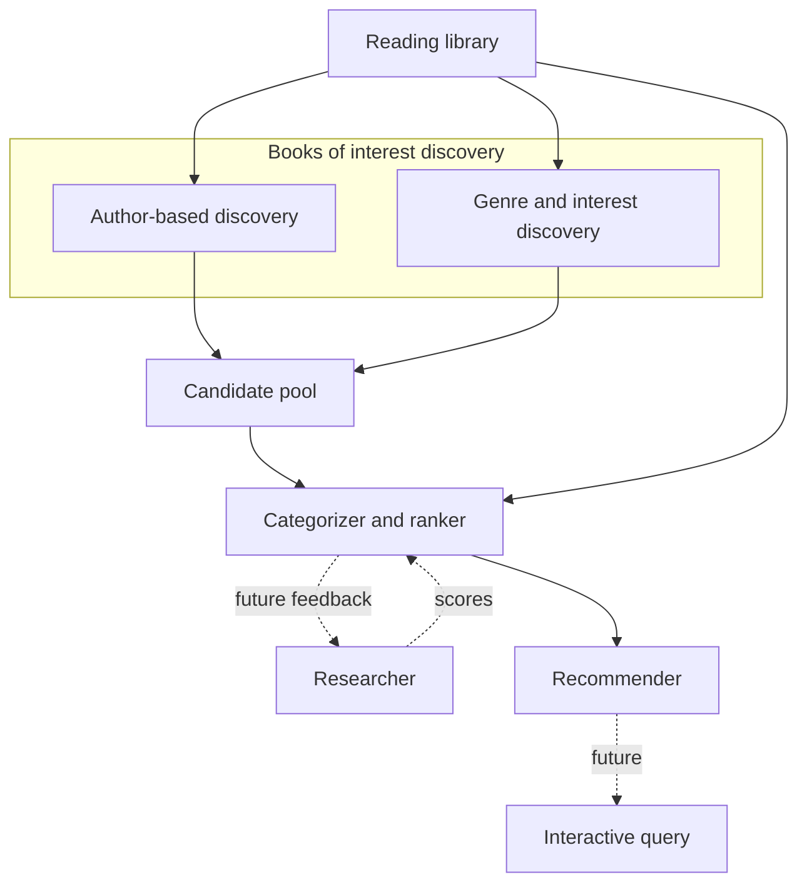

# Book Advisor — system architecture (intent)

This document is the **high-level intent** for how Book Advisor fits together: major components, data flow, and what exists today versus what is planned. It avoids locking in specific databases, models, or vendor choices.

## Purpose

Book Advisor aims to produce **personalized book recommendations** by learning from **what you have read**, **how you rated (and described) those books**, **when you read them**, and derived signals such as **series continuity**, **taste**, and **release availability**. The end state is a small set of **top picks** that respect both your history and what is actually available to read now.

## Reading library (implemented baseline)

The canonical signal for **books you have finished (or shelved as read)**, **star ratings**, **reviews**, and **dates** comes from your **Goodreads desktop library export** (`goodreads_library_export.csv`).

- **Code:** [`src/goodreads/`](../goodreads/) — CSV parsing and [`GoodreadsLibraryClient`](../goodreads/client.py).
- **Local data:** [`src/goodreads/data/README.md`](../goodreads/data/README.md) (gitignored CSV for your personal export).
- **Today:** the [`book_advisor` CLI](run.py) command `reading_history` reads that export and prints a simple view of read books and ratings. The **same library data** is intended to feed all downstream stages.

## Books of interest discovery (planned)

**Books of interest discovery** is a **single conceptual stage** that produces a **large merged list of candidate books**. It takes the **reading library** (and configured taste signals such as preferred genres or topics) as input. Internally it has **two parts**, which may live in separate modules or packages later but are one pipeline for discovery purposes:

1. **Author-based discovery** — finds **other books by authors you have already read**. This path is expected to surface many **series continuations** and same-author follow-ups without a separate “sequel scraper” discovery arm: the ranker (below) handles **how much** to prefer those books once they appear as candidates.

2. **Genre / interest-based discovery** — finds books aligned with **genres or topics** you care about (from your history, explicit preferences, or both), via catalogs, APIs, or other sources TBD.

The two parts **both contribute candidates** into a **candidate pool** with **deduplication and identity resolution** as needed. They are not separate top-level architecture branches—just two methodologies inside one discovery stage.

## Categorizer / ranker (planned)

The **categorizer / ranker** takes the **candidate pool** from books of interest discovery and the **reading library** (for personalization and context).

It:

- Assigns books to **categories**.
- **Stack-ranks within each category** according to your interests.

**Series-aware ranking (not a separate discovery pipeline):** the ranker applies **extra weight** and **annotations** to candidates that belong to a **series you have already read** (or started). How much weight to add can depend on **how you rated other books in that series**, consistency of engagement, recency, and **other factors** TBD. Realizing this may require **series or work-level metadata** (e.g. resolving “book N of …”) from external data or light scraping—but that work serves **ranking and explanation**, not building the initial candidate list alongside author/genre discovery.

Output is **ranked lists per category**, not yet the final short “read this next” list.

## Researcher loop (future enhancement)

For **high-ranked candidates**, a **researcher** stage performs **deeper investigation**: richer synthesis of reviews, optional exposure to **samples** of the text, and **multi-dimensional personalized scores** (e.g. pace, difficulty, mood fit—exact dimensions TBD).

Those scores **feed back** into the **ranker** to refine ordering. Architecturally this is an **iterative refinement loop** between ranker and researcher, not a single linear pass.

## Recommender (planned)

The **recommender** takes **rankings** and **release / availability** (what is out now vs upcoming) and produces a **small set of top picks** for a given moment.

**Future:** an **interactive layer** (e.g. conversational agent) so you can ask for constraints in natural language—“something **action**-oriented and **easy to read**”—and have that **reshape** how top picks are chosen from the ranked pool.

## End-to-end flow

The **reading library** feeds **books of interest discovery** (author-based and genre/interest-based parts). Their outputs merge into a **candidate pool**. The **categorizer / ranker** also uses the **reading library** for personalization and **series-aware weights and annotations**. Then (optionally) **researcher** feedback, **recommender**, and eventually **interactive** queries.

## Current vs planned

| Area | Status |
|------|--------|
| Reading library from Goodreads CSV | **Implemented** ([`goodreads`](../goodreads/)) |
| CLI: `reading_history` | **Implemented** ([`run.py`](run.py)) |
| Books of interest discovery (author + genre/interest) | **Planned** |
| Categorizer / ranker (incl. series-aware weight + annotation) | **Planned** |
| Researcher loop (deep dive, multi-dim scores) | **Future** |
| Recommender (top picks + release awareness) | **Planned** |
| Interactive / NL constraints on picks | **Future** |

## Repository layout principle

New **concerns** should appear as **separate packages or directories under [`src/`](../../src/)**, with [`book_advisor`](README.md) responsible for **orchestration**, **CLI**, and **wiring**—not for owning every algorithm or adapter.
