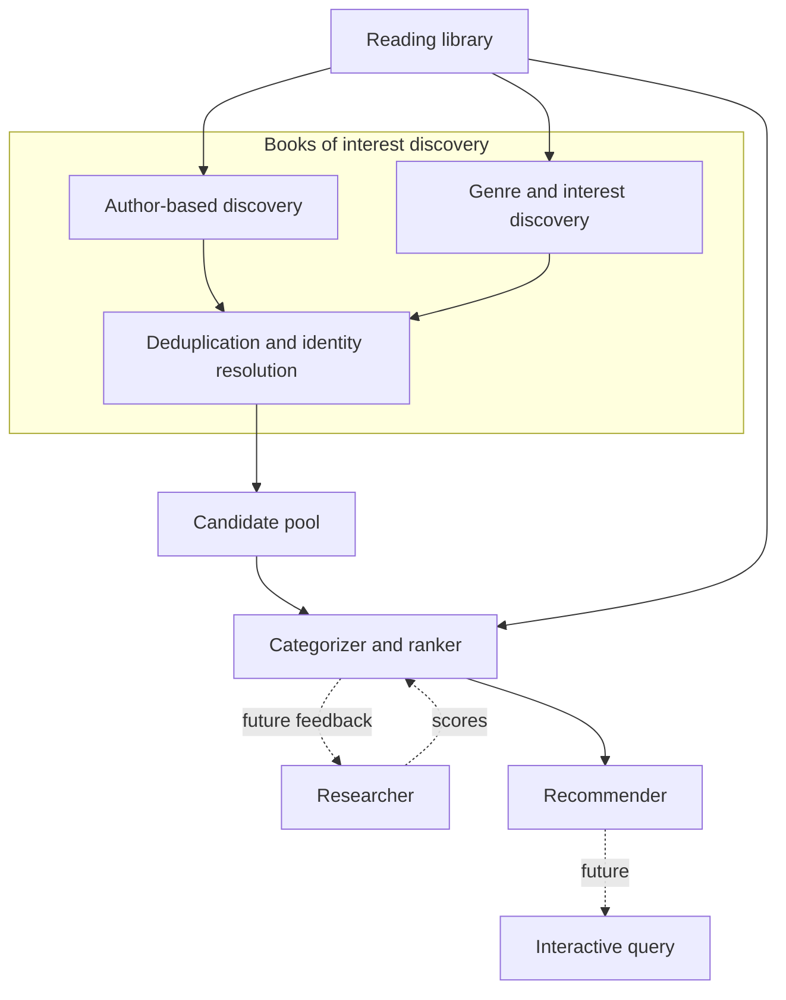

# Book Advisor — system architecture (intent)

This document is the **high-level intent** for how Book Advisor fits together: major components, data flow, and what exists today versus what is planned. It avoids locking in specific databases, models, or vendor choices.

## Implementation tracking

**Checklists:** As concrete implementation plans are drafted, we add **checkbox lists** under the relevant architecture section (or here for cross-cutting work). While implementing, **mark items complete** by changing `[ ]` to `[x]` so the doc stays a live map of done vs remaining work.

**When to update:** (1) **Drafting a plan** — add or extend checklist steps to match the plan. (2) **Completing a step** — check it off in this file in the same change set as the code (or immediately after).

## Purpose

Book Advisor aims to produce **personalized book recommendations** by learning from **what you have read**, **how you rated (and described) those books**, **when you read them**, and derived signals such as **series continuity**, **taste**, and **release availability**. The end state is a small set of **top picks** that respect both your history and what is actually available to read now.

## Reading library (implemented baseline)

The canonical signal for **books you have finished (or shelved as read)**, **star ratings**, **reviews**, and **dates** comes from your **Goodreads desktop library export** (`goodreads_library_export.csv`).

- **Code:** [`src/reading_history/`](../reading_history/) — reading-history ingestion; today the Goodreads CSV lives under [`goodreads_export/`](../reading_history/goodreads_export/) ([`GoodreadsLibraryClient`](../reading_history/goodreads_export/client.py), [`parse_library_csv`](../reading_history/goodreads_export/read_csv.py)).
- **Local data:** Repo-root [`data/README.md`](../../data/README.md) — place **`goodreads_library_export.csv`** there (gitignored); see that file for all persisted artifacts.
- **Today:** the [`book_advisor` CLI](run.py) command `reading_history` reads that export and prints a simple view of read books and ratings. The **same library data** is intended to feed all downstream stages.

## Books of interest discovery (planned)

**Books of interest discovery** is a **single conceptual stage** that produces a **large merged list of candidate books**. It takes the **reading library** (and configured taste signals such as preferred genres or topics) as input. Internally it has **two sourcing paths** plus a **deduplication / identity-resolution pass** that runs on their combined output before the result is treated as a stable **candidate pool**:

1. **Author-based discovery** — finds **other books by authors you have already read**. This path is expected to surface many **series continuations** and same-author follow-ups without a separate “sequel scraper” discovery arm: the ranker (below) handles **how much** to prefer those books once they appear as candidates.

2. **Genre / interest-based discovery** — finds books aligned with **genres or topics** you care about (from your history, explicit preferences, or both), via catalogs, APIs, or other sources TBD.

3. **Deduplication / identity resolution** — after raw candidates are merged, a **dedupe stage** collapses entries that refer to the **same logical work** but appear as multiple rows (e.g. different catalog keys or editions, noisy titles, overlapping Open Library work vs edition records). Today’s persistence only keys on `(catalog, external_id)` inside a single source stream, so **cross-record duplicates are expected until this stage exists**. The dedupe pass may introduce **canonical work identifiers**, **cluster metadata**, or **merge rules** (exact vs fuzzy matching) and should run **inside** discovery—before the ranker—so downstream stages see one candidate per resolved work where possible.

The sourcing paths and the dedupe pass are **not** separate top-level architecture branches; they are **sub-stages of one discovery pipeline** that feeds the categorizer / ranker.

### Catalog vendor strategy: Open Library, Google Books, optional Amazon

Discovery uses a pluggable **`AuthorWorksCatalog`** so the backing API can change without rewriting the whole pipeline.

**Near-term primary (planned): [Google Books API](https://developers.google.com/books)** — Build and harden the rest of the tool (ranker, recommender, workflow) with **Google Books** as the main author/title discovery source: **API key + quota**, generally strong search coverage, and **ISBN-friendly** metadata for dedupe. Results are **not** guaranteed to line up 1:1 with a specific **Kindle** product page; bridging to “what I can open on Kindle” can be a later step (manual links, ASIN lookup, or a retail API).

**Open Library (current first adapter):** The shipped v1 code uses **Open Library** because it is **keyless** and easy to automate. In practice it has proven **weak for this project’s goals**: **author search often returns nothing** while the same author exists on the website under a resolved author record; **coverage is uneven** for active or indie authors and **series are frequently incomplete** (e.g. only some volumes attached to a work); the **work/edition graph** creates **heavy deduplication** burden and duplicate work IDs with **disjoint edition sets** (so even ISBN-based clustering does not always merge obvious duplicates). These issues are **catalog quality and coverage**, not fixable purely by better OL query strings—so OL is **not** the long-term primary source.

**Future expansion: Amazon (Associates / retail APIs)** — For **Kindle-first** reading (buy or borrow in the Kindle ecosystem), **Amazon** is the most faithful catalog of **what is actually listed**. Using **Product Advertising API** (being superseded for **new** integrations by **[Creators API](https://affiliate-program.amazon.com/creatorsapi/docs/en-us/introduction)** per current Amazon documentation) typically requires **Amazon Associates** compliance: a **declared public Site** (or qualifying app/social channel) with **substantive original content**, **tagged links** as required, and **program rules** (including review after **qualifying referred sales**—personal purchases do not count). That bar is **intentionally deferred** until the rest of Book Advisor is **working end-to-end**; then scope can expand (e.g. a small public site or channel) if retail-aligned discovery is worth the operational overhead.

### Implementation checklist (books of interest discovery)

Rolling plan: author-based pipeline and persistence first; genre/interest later. See the Cursor plan *Author discovery persistence CLI* for detail.

- [x] **Step 1 — Author-based discovery** — `src/discovery/` package: extract authors from the read shelf, catalog protocol + adapter, orchestration to produce normalized candidate records. *(Shipped with **Open Library**; **Google Books** adapter planned as primary per [Catalog vendor strategy](#catalog-vendor-strategy-open-library-google-books-optional-amazon) above.)*
- [x] **Step 2 — Persistence** — SQLite (or chosen) store for candidates; default DB under repo-root **`data/`** (e.g. `data/discovery/candidates.sqlite`, gitignored); upsert and query APIs.
- [x] **Step 3 — CLI** — `book-advisor discovery update` and `book-advisor discovery list` (or equivalent) wired from [`run.py`](run.py); defaults for CSV path and DB path.
- [ ] **Step 4 — Genre / interest-based discovery** — *Deferred; not part of the current rollout.*
- [ ] **Step 5 — Deduplication / identity resolution** — Post-merge pass on discovery output: collapse duplicate logical works (cross-key and fuzzy identity), update storage and CLI/listing as needed so the candidate pool is not full of near-duplicate rows. May ship incrementally (author-only catalog first) before genre sourcing lands.

## Categorizer / ranker (planned)

The **categorizer / ranker** takes the **candidate pool** from books of interest discovery and the **reading library** (for personalization and context).

It:

- Assigns books to **categories**.
- **Stack-ranks within each category** according to your interests.

**Series-aware ranking (not a separate discovery pipeline):** the ranker applies **extra weight** and **annotations** to candidates that belong to a **series you have already read** (or started). How much weight to add can depend on **how you rated other books in that series**, consistency of engagement, recency, and **other factors** TBD. Realizing this may require **series or work-level metadata** (e.g. resolving “book N of …”) from external data or light scraping—but that work serves **ranking and explanation**, not building the initial candidate list alongside author/genre discovery.

Output is **ranked lists per category**, not yet the final short “read this next” list.

## Researcher loop (future enhancement)

For **high-ranked candidates**, a **researcher** stage performs **deeper investigation**: richer synthesis of reviews, optional exposure to **samples** of the text, and **multi-dimensional personalized scores** (e.g. pace, difficulty, mood fit—exact dimensions TBD).

Those scores **feed back** into the **ranker** to refine ordering. Architecturally this is an **iterative refinement loop** between ranker and researcher, not a single linear pass.

## Recommender (planned)

The **recommender** takes **rankings** and **release / availability** (what is out now vs upcoming) and produces a **small set of top picks** for a given moment.

**Future:** an **interactive layer** (e.g. conversational agent) so you can ask for constraints in natural language—“something **action**-oriented and **easy to read**”—and have that **reshape** how top picks are chosen from the ranked pool.

## End-to-end flow

The **reading library** feeds **books of interest discovery** (author-based and genre/interest sourcing, then **deduplication / identity resolution**). The resulting **candidate pool** feeds the **categorizer / ranker**, which also uses the **reading library** for personalization and **series-aware weights and annotations**. Then (optionally) **researcher** feedback, **recommender**, and eventually **interactive** queries.

## Current vs planned

| Area | Status |
|------|--------|
| Reading library (Goodreads CSV export) | **Implemented** ([`reading_history/goodreads_export`](../reading_history/goodreads_export/)) |
| CLI: `reading_history` | **Implemented** ([`run.py`](run.py)) |
| Books of interest discovery (author-based path) | **Implemented** with **Open Library** ([`discovery`](../discovery/)); **Google Books** as planned primary catalog; **Amazon** retail/affiliate path **deferred**; deduplication **planned**; genre/interest **planned** |
| Categorizer / ranker (incl. series-aware weight + annotation) | **Planned** |
| Researcher loop (deep dive, multi-dim scores) | **Future** |
| Recommender (top picks + release awareness) | **Planned** |
| Interactive / NL constraints on picks | **Future** |

## Repository layout principle

New **concerns** should appear as **separate packages or directories under [`src/`](../../src/)**, with [`book_advisor`](README.md) responsible for **orchestration**, **CLI**, and **wiring**—not for owning every algorithm or adapter.

### Directory naming under `src/`

- **First level under `src/`** (e.g. [`reading_history/`](../reading_history/), [`discovery/`](../discovery/)) names the **purpose** of the concern—typically aligned with a **stage** or major area in the architecture flow (reading history ingestion, books-of-interest discovery, the runnable app in `book_advisor/`, etc.).
- **Subdirectories inside those packages** (e.g. [`reading_history/goodreads_export/`](../reading_history/goodreads_export/), [`discovery/open_library/`](../discovery/open_library/)) usually denote a **specific implementation path**: a **third-party source**, export format, or adapter. That keeps multi-source or multi-format evolution localized without renaming the top-level concern when a new backend is added.
